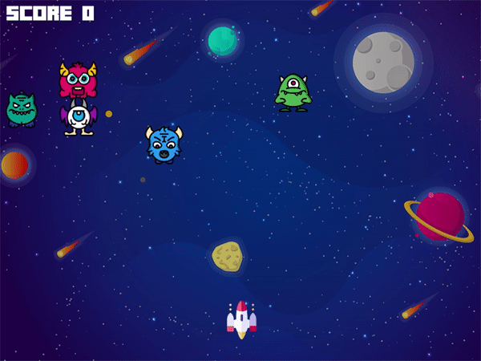

Space-Invaders
===========

The classic Space-Invaders game implementation, using pygame package.

Installation
============

Required python version: Python 3.7.0

The repository requires pip client library to work properly.
It is highly recommended to use PyCharm, which supports pip.

In case you don't want to use PyCharm, you should make sure pip is present in your PATH variable in your shell.
Latest pip version: pip 20.2.2

Package needed for the script: pygame.

Download the repository from GitHub, and start developing :)

Game Instructions:
============

As the game begins, 5 monsters will appear on the screen and will start moving slowly at your direction.

Your spaceship must shoot all space aliens before they reach you.

Use the Left and Right arrow to move the spaceship left and right, then shoot with the Space bar. 

Your score will appear on the left upper corner of the screen.

The game will over once one of the aliens will reach the spaceship at the bottom of the screen.
 

python version check:
=============
``
$ python --version
``

pip version check:
=============
``
$ pip --version
``

Simple package install in shell:
=============
``
$ pip install pygame
``

Running the game:
=============
``
$ python main.py
``

Cloning the repository from GitHub:
=============
``
$ git clone https://github.com/nofarezra/space-invaders.git
``